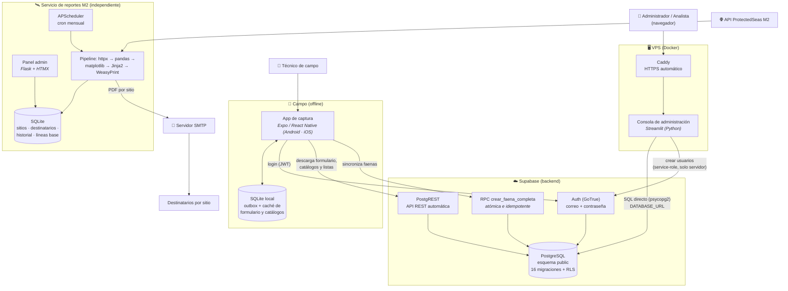
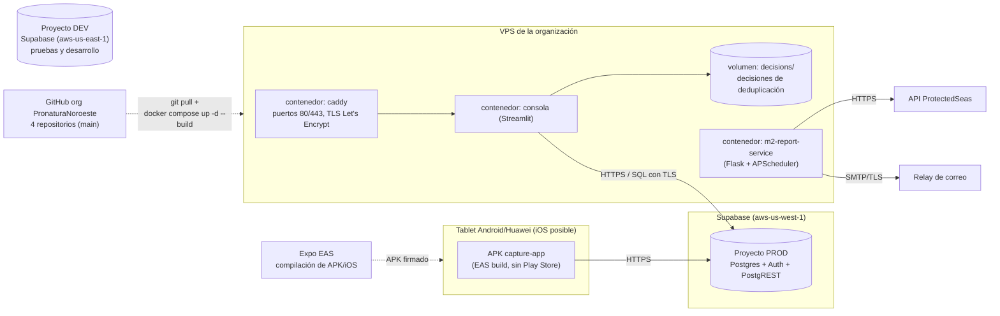
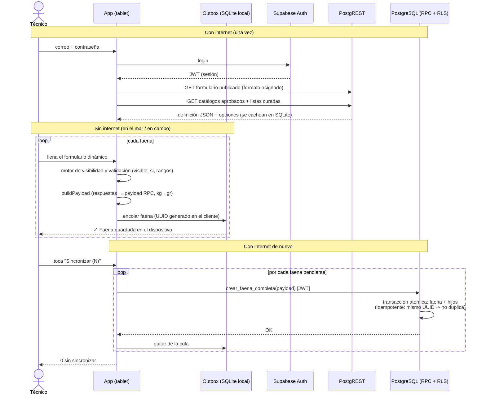
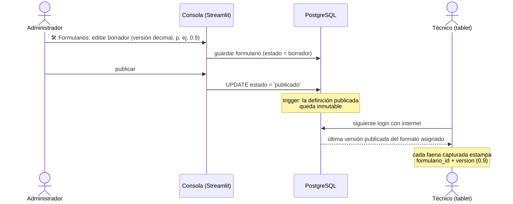
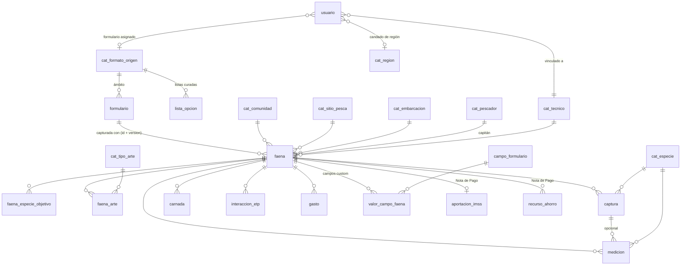

# Diagrama de Arquitectura — Sistema de Bitácoras Pesqueras Pronatura Noroeste

Diagramas UML en notación **Mermaid** (se renderizan automáticamente en GitHub, VS Code
y la mayoría de visores Markdown). Actualizado al 2026-07-09.

---

## 1. Diagrama de componentes (vista general del sistema)

**Puntos clave:** la app nunca toca la base directamente — todo pasa por Auth + PostgREST
+ la RPC, gobernados por RLS. La consola usa conexión directa a Postgres y la llave
service-role, que viven solo en el servidor. El servicio M2 es completamente independiente
del backend de bitácoras.

---

## 2. Diagrama de despliegue

---

## 3. Diagrama de secuencia — captura offline y sincronización

---

## 4. Diagrama de secuencia — publicación de un formulario

---

## 5. Modelo entidad–relación (núcleo)

El detalle completo de columnas, tipos y restricciones está en
[`Diccionario_de_Datos.md`](Diccionario_de_Datos.md).
